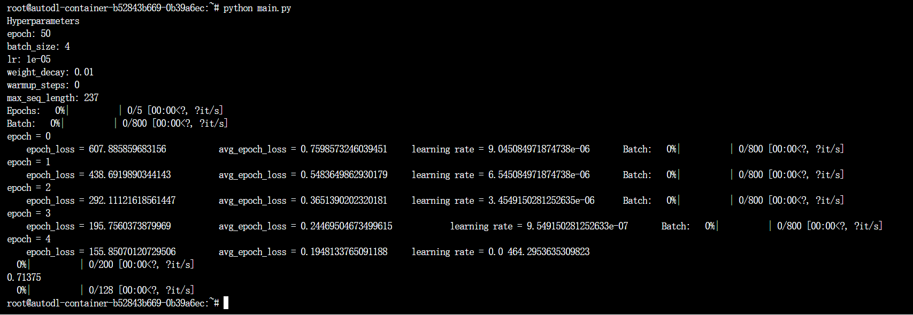

### 实验五——多模态融合

##### Github仓库：

https://github.com/volcano26/Multimodal

#### 实验环境：Autodl

CPU ：16 核心
内存：120 GB
GPU ：NVIDIA GeForce RTX 4090, 1

#### 1.代码介绍

##### 1）数据预处理

```python
def read_and_process_data(txt_filepath, output_csv_filepath):
    df_txt = pd.read_csv(txt_filepath, header=None, names=['guid', 'tag'], dtype={'guid': str, 'tag': str})

    df_result = pd.DataFrame(columns=['guid', 'text', 'tag'])

    for index, row in df_txt.iterrows():
        guid = row['guid']
        txt_filename = f"{guid}.txt"
        txt_filepath = os.path.join('data', txt_filename)

        if os.path.exists(txt_filepath):

            with open(txt_filepath, 'rb') as txt_file:
                raw_data = txt_file.read()
                result = chardet.detect(raw_data)
                encoding = result['encoding']

            with open(txt_filepath, 'r', encoding=encoding, errors='replace') as txt_file:
                text = txt_file.read().strip(",")

            df_result = df_result.append({'guid': guid, 'text': text, 'tag': row['tag']}, ignore_index=True)
        else:
            print(f"Warning: Text file not found for guid {guid}")

    df_result['img_path'] = df_result['guid'].apply(lambda guid: f'data/{guid}.jpg')

    df_result.to_csv(output_csv_filepath, index=False)
```

```python
train_txt_filepath = 'train.txt'
train_csv_filepath = 'train.csv'
read_and_process_data(train_txt_filepath, train_csv_filepath)

train_df = pd.read_csv(train_csv_filepath)

train_set, val_set = train_test_split(train_df, test_size=0.2, random_state=42)

print(f'Training set shape: {train_set.shape}')
print(f'Validation set shape: {val_set.shape}')


train_train_csv_filepath = 'train_train.csv'
train_val_csv_filepath = 'train_val.csv'
train_set.to_csv(train_train_csv_filepath, index=False)
val_set.to_csv(train_val_csv_filepath, index=False)

test_txt_filepath = 'test_without_label.txt'
test_csv_filepath = 'test.csv'
read_and_process_data(test_txt_filepath, test_csv_filepath, is_test=True)

```

这里我将txt文件进行数据的预处理，将其修改为csv文件的同时，在每个csv文件中添加**guid，其对应的text文本，其对应的img路径以及其tag标签**，以方便我后续对于其信息的处理效率（不需要每次寻找调用txt文件）


而后以**20%验证集，80%训练集**的比例进行划分，形成train_train.csv,train_val.csv两个文件存储

##### 2）bert模型介绍


```python
class BertModel(nn.Module):
    def __init__(self, num_labels, text_pretrained='./bert-base-uncased'):
        super().__init__()
        self.num_labels = num_labels
        self.text_encoder = AutoModel.from_pretrained(text_pretrained)
        self.classifier = nn.Linear(self.text_encoder.config.hidden_size, num_labels)

    def forward(self, text):
        output = self.text_encoder(text.input_ids, attention_mask=text.attention_mask, return_dict=True)
        logits = self.classifier(output.last_hidden_state[:, 0, :]) 
        return logits
```

其中` logits = self.classifier(output.last_hidden_state[:, 0, :]) `这一行代码我使用的是CLS embedding；因为`[CLS]`所对应的Embedding被使用来代表句义的原理，所以比较适合于在进行text文本（特别是单句话的情况使用）

我这里使用的预训练模型是`bert-base-uncased`(这里很多遇到的问题会在后面讲)


##### 3）resnet模型


```python
class ResNetDataset(Dataset):
    def __init__(self, df, label_to_id, train=False, text_field="text", label_field="tag", image_path_field="img_path"):
        self.df = df.reset_index(drop=True)
        self.label_to_id = label_to_id
        self.train = train
        self.text_field = text_field
        self.label_field = label_field
        self.image_path_field = image_path_field

        # ResNet-50 settings
        self.img_size = 224
        self.mean, self.std = (
            0.48145466, 0.4578275, 0.40821073), (0.26862954, 0.26130258, 0.27577711)


        self.train_transform_func = transforms.Compose(
                [transforms.RandomResizedCrop(self.img_size, scale=(0.5, 1.0)),
                    transforms.RandomHorizontalFlip(),
                    transforms.ToTensor(),
                    transforms.Normalize(self.mean, self.std)
                    ])

        self.eval_transform_func = transforms.Compose(
                [transforms.Resize(256),
                    transforms.CenterCrop(self.img_size),
                    transforms.ToTensor(),
                    transforms.Normalize(self.mean, self.std)
                    ])


    def __getitem__(self, index):
        text = str(self.df.at[index, self.text_field])
        label = self.label_to_id.get(self.df.at[index, self.label_field], -1)
        # self.label_to_id[self.df.at[index, self.label_field]]
        img_path = self.df.at[index, self.image_path_field]


        image = Image.open(IMG_FOLDER + '/' + img_path)
        if self.train:
          img = self.train_transform_func(image)
        else:
          img = self.eval_transform_func(image)

        return text, label, img

    def __len__(self):
        return self.df.shape[0]
```

使用的是resnet-50模型;使用残差块来更好的进行图像的识别

##### 4）模型融合


```python
class MML(nn.Module):
    def __init__(self, input_size1, input_size2, hidden_size, output_size):
        super().__init__()
        self.fc1 = nn.Linear(input_size1 + input_size2, hidden_size)
        self.relu = nn.ReLU()
        self.fc2 = nn.Linear(hidden_size, output_size)

    def forward(self, x1, x2):
        x = torch.cat((x1, x2), dim=1)
        x = self.fc1(x)
        x = self.relu(x)
        x = self.fc2(x)
        return x
class MMLmodel(nn.Module):
    def __init__(self, num_labels, text_pretrained='./bert-base-uncased', hidden_size=512):
        super().__init__()
        self.text_encoder = AutoModel.from_pretrained(text_pretrained)
        self.visual_encoder = FeatureModel(output_layer='avgpool')
        self.image_hidden_size = 2048
        self.mlp_text = nn.Linear(self.text_encoder.config.hidden_size, num_labels)
        self.mlp_image = nn.Linear(self.image_hidden_size, num_labels)
        self.mlp_both = MML(self.text_encoder.config.hidden_size, self.image_hidden_size, hidden_size, num_labels)

    def forward(self, text, image, mode='both'):
        text_output = self.text_encoder(**text)
        text_feature = text_output.last_hidden_state[:, 0, :]
        img_feature = self.visual_encoder(image)

        if mode == 'text':
            logits = self.mlp_text(text_feature)
        elif mode == 'image':
            logits = self.mlp_image(img_feature)
        else:  # 'both'
            logits = self.mlp_both(text_feature, img_feature)

        return logits
```

使用MLP，多层感知机进行模块的融合；多层感知机是一种**前向传递类神经网路**，利用到倒传递的技术达到监督式学习，将文本和图像的bert和resnet50两个模型相互交叉融合（这里一定要保证其输出的层数维度一致，不然矩阵乘法会报错）

#### 2.遇到的问题

##### 1）bert预训练模型下载

遇到直接使用代码超时

```bash
OSError: We couldn't connect to 'https://huggingface.co' to load this file, couldn't find it in the cached files and it looks like bert-base-uncased is not the path to a directory containing a file named config.json.
```

**解决方案1：** 登入官网下载其所需要的文件（pytorch或者tensorflow），而后将代码中的预训练模型改为本地链接

```python
def __init__(self, num_labels, text_pretrained='./bert-base-uncased')
```

这样子操作我能够在本地电脑中运行，但是因为文件太大上传至服务器会有所丢失导致其bin文件不完整

```bash
OSError: Unable to load weights from pytorch checkpoint file for 'bert-base-uncased' at ... If you tried to load a PyTorch model from a TF 2.0 checkpoint, please set from_tf=True.
```

**解决方案2：**

安装依赖

```bash
pip install -U huggingface_hubCopy
```

输入命令

```bash
export HF_ENDPOINT=https://hf-mirror.comCopy
huggingface-cli download --resume-download --local-dir-use-symlinks False bert-base-uncased --local-dir bert-base-uncased
```

直接在云服务器上面下载

##### 2）读取txt文件数据时候报错

我代码先对于txt文件进行预处理，保存为csv文件，但其文本格式一直报错

使用`chardet`包先对于文本进行格式的判断，而后添加`errors='replace'`阻止其报错（只会有warning出现）

```python
            with open(txt_filepath, 'rb') as txt_file:
                raw_data = txt_file.read()
                result = chardet.detect(raw_data)
                encoding = result['encoding']

            with open(txt_filepath, 'r', encoding=encoding, errors='replace') as txt_file:
                text = txt_file.read().strip(",")
```

#### 3.结果分析

##### 1)只使用文本

可以看到只使用文本在验证集的准确率仅有0.2175


##### 2）只使用图像

验证集准确率为0.71375



##### 3）文本图像相互结合

验证集准确率为0.69875


可以看到其损失值已经趋近于平滑，基本上达到拟合状态

**疑问点：**为什么使用多模态融合的结果反而不如单使用图像识别的准确率（个人猜测是因为单使用文本的准确率过低所以拉低了融合预测的准确率）